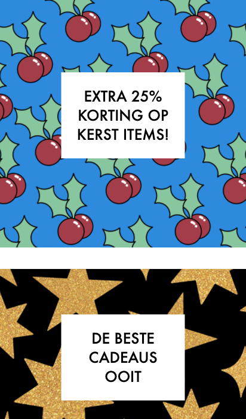
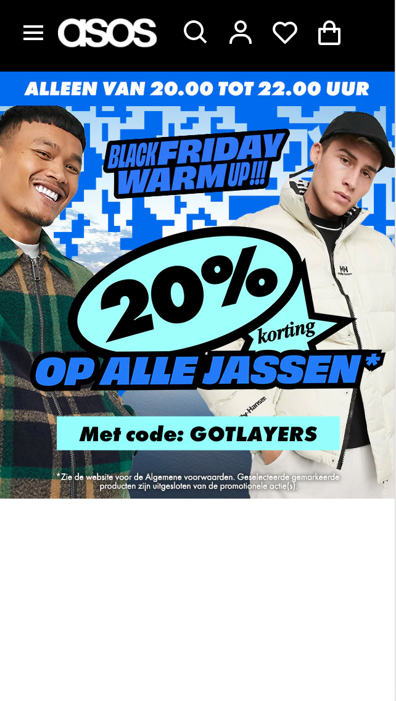

# Procesverslag
**Auteur:** -Daan Thai-

Markdown cheat cheet: [Hulp bij het schrijven van Markdown](https://github.com/adam-p/markdown-here/wiki/Markdown-Cheatsheet). Nb. de standaardstructuur en de spartaanse opmaak zijn helemaal prima. Het gaat om de inhoud van je procesverslag. Besteedt de tijd voor pracht en praal aan je website.

## Bronnenlijst
1. -ASOS-
Access Denied. (z.d.). Geraadpleegd op 25 november 2020, van https://www.asos.com/nl/heren/
2. -Quora-
How to position text to center on an image with CSS. (z.d.). Geraadpleegd op 10 januari 2021, van https://www.tutorialspoint.com/How-to-position-text-to-center-on-an-image-with-CSS

## Eindgesprek (week 7/8)

-dit ging goed & dit was lastig-

**Screenshot(s):**

-screenshot(s) van je eindresultaat-

## Voortgang 3 (week 6)

Positioneren ging goed.

## Voortgang 2 (week 5)

Banner maken ging goed, alleen centreren van de tekst was moeilijk.

## Voortgang 1 (week 3)

### Stand van zaken

Navigatie maken ging goed, alleen positioneren vind ik nog moeilijk.

Navigatie bijna af en bezig met main.

### Agenda voor meeting

-samen met je groepje opstellen-

| Daan | Andrej | Jeffrey | Bilal |
| --- | --- | --- | --- |
| Hoe zet je de navigatie vanaf de searchbutton tot winkelmand naar rechts? | De website newgrounds.com lijkt mij toch te lastig voor een blauwe piste. Is dit een correcte observatie of lijkt dat moeilijker dan dat het is? (Surface) | Hoe kan je een slider het beste aanmaken? ( dus afbeelding met 4 klikbare bolletjes erin om van afbeelding te switchen ) | Zijn er nog een aantal makkelijkere opdrachten om te doen voor javascript ,omdat ik javascript iets te moeilijk vindt om te doen? |
| | Hoe zet je een looped video op de achtergrond en kan ik bovenop die videos nog images plaatsen? | | Ik heb een video gekeken voor een hamburger menu, deze video maakt gebruik van jquery. Mag je jquery gebruiken als je snapt wat er gebeurt? |
| | Hoe goed moet je het minimale javascript onderdeel nou snappen om het te gebruiken? | | |
| | Is de website https://osu.ppy.sh/home een geschiktere website als blauwe piste in uw mening? | | |

## Breakdownschets (week 1)

## Intake (week 1)
-uitwerken voor de kick-off werkgroep - begin van de eerste week-

**Je startniveau:** Blauw

**Je focus:** Surface plane

**Je opdracht:** https://www.asos.com/nl/heren/

**Screenshot(s) van de eerste pagina (small screen):**

**Screenshot(s) van de tweede pagina (small screen):**

